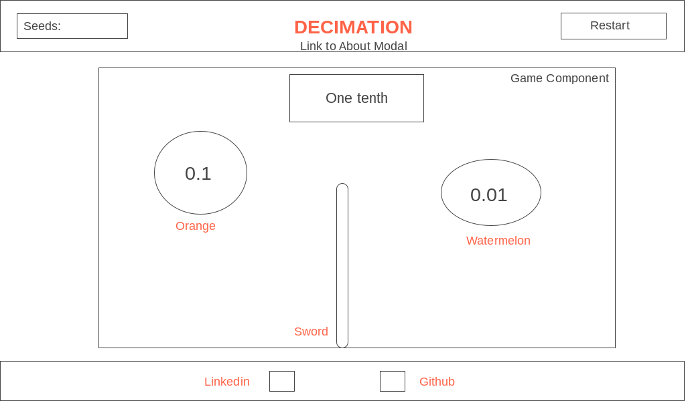

# Decimation

##Sample JS Project Proposal

### About
  Decimals...Fruit...what more could you ask for in a game. Tapping into the gamification trend in education, Decimation is a one play game that not only tests your knowledge of decimal places but also your slicing skills. A decimal value will appear in written notation at the top of the playing field, and depending on the level of the game, pieces of fruit will fly at you with various decimal numbers. You slice the fruit when you find the matching number.  

### Functionality & MVP

Decimation will allows users to:
  -Start, Pause, Stop and restart a game
  -Gain seeds by slicing open the correct fruits
  -Earn a spot on the leader board through seed accumulation!!
  -Level up to increase both the difficult of the numbers and the speed of the fruit

 ### Wireframes
  Decimation will be a single page app with a navbar that provides a dropdown menu with controls to Start, Stop, Pause and End the game. Additionally, the users seed count will be displayed and updated in real time. Finally, there will be an introductory modal explaining the game. The page will also have live links to both my Linked in account and Github repo.

### Composition and Technology
  The app will be created using the subsequent technologies:
    * browserfy to bundle js files
    * JavaScript for game logic
    * Canvas and HTML5 for rendering

  The game will rely upon four scripts:
    * board.js: will handle the logic of the game board and will handle the updating necessary elements, which will cause rerenders.  
    * fruit.js: will manage the logic of the fruits being displayed on the board. Each fruit object will hold a decimal value and a path.
    * ninja.js: responsible for user movements and scores.
    * grid.js: will create a grid system that will hold the value of the fruit while the fruit object passes through it. It will also maintain a answerState(true or false) that will determine wether the user sliced the right fruit.

### Implementation Details

Day 1:
  * Implement all node modules, including browserfy. Create a simple entry file.
  * Learn Canvas

Day 2:
  * Build out the board.js logic and allow the fruit objects to communicate with the board object.
  * Create the cell.js to connect with the fruit and ninja.js. Ensure each grid object has the ability to toggle between its answerState.
  * Add the decimal box, which will hold the question value.

Day 3:
  * Create the ninja.js that will connect to the grid.js.
  * Implement modular functions that will handle the slice logic of the ninja

Day 4:
  * Integrate user controls that will allow the player to start, stop and reset the game.
  * Implement a leader board that will locally store the top ten seed scores
